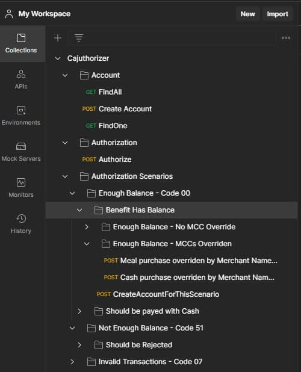
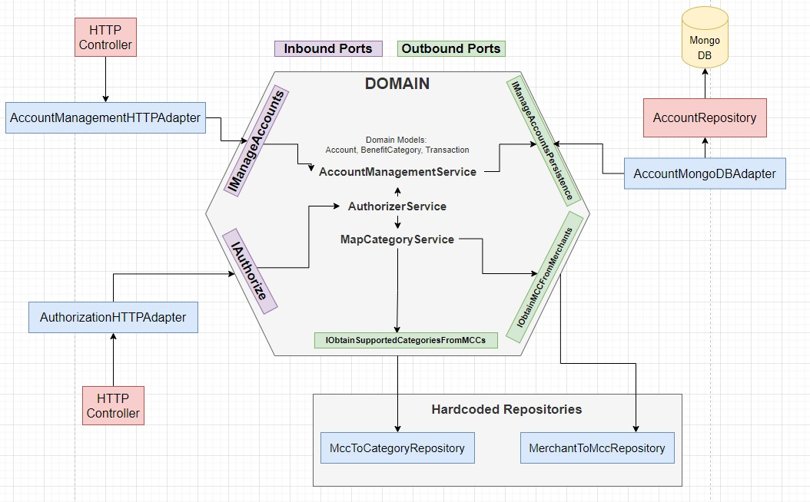

# Cajuthorizer

Hello! This README aims to help you in running the cajuthorizer application and explaining a little
about the way it was built and discuss some ideas. You can also start by getting familiar with the [Challenge](Challenge.pdf), and after that, you can come back to these instructions!

Have fun!

## How to run it

**Let's get straight to the point:**

There are 3 main ways to run it:

1. From the contained docker-compose.yml file. It will deploy the application together with the
database. (RECOMMENDED)
2. As a standalone docker image. You can build it locally, or get it from
rodrigoom/cajuthorizer:1.
3. From an SBT Task


for the sake of brevity, I will describe the recommended way here and jump to the next topics, but
instructions for the other ways to run it will be described at the end of this README.

## 1. Docker-Compose

**Dependencies:**

[Docker](https://www.docker.com/get-started)

**Running it:**

From inside the project root folder (if you see the docker-compose.yml, that's the place):

And that's it. The application will be acessible by the local port 9000, and MongoDB will be
acessible through 27017.

## Testing the application

Inside the project root folder, there is a _Cajuthorizer.postman_collection.json_ file containing a
Postman collection you can import. It contains multiple scenarios for testing (Like "Not Enough
Balance - Code 51") + the endpoints you can play around.

.

```
docker-compose up
```

I highly recommend importing this, but if you don't want to do that now, it's ok, here are the main
requests in curl version:

Create Account

```
curl --location --request POST 'http://localhost:9000/account' \
--header 'Content-Type: application/json' \
--data-raw '{
"id": 1 ,
"mealBalance": 1000 ,
"foodBalance": 1000 ,
"cultureBalance": 1000 ,
"cashBalance": 1000
}'
```

Find Account

```
curl --location --request GET 'http://localhost:9000/account/1'
```

Find All Accounts

```
curl --location --request GET 'http://localhost:9000/accounts'
```

Authorize a transaction

```
curl --location --request POST 'http://localhost:9000/authorize' \
--header 'Content-Type: application/json' \
--data-raw '{
"account": "1",
"totalAmount": 100.00,
"mcc": "5811",
"merchant": "PADARIA DO ZE
SAO PAULO BR"
}'
```

## How it was built

.


Core technology versions:


[Java OpenJDK](https://scoop-docs.vercel.app/docs/guides/Java.html#choice-of-jdks)
[SBT 1.5.](https://www.scala-sbt.org/download.html) 
[Scala 2.13](https://www.scala-lang.org/download/2.13.6.html)


Following a [Hexagonal Architecture](https://alistair.cockburn.us/hexagonal-architecture/), I've built Inbound and Outbound ports to keep domain
isolated, and technology-specific adapters (except for the hardcoded mcc -> category repositories,
which I thought building adapters for them would be overkill, so they currently implement the
outbound ports without adapters)

### The Model

I may have commented this inside the code, but I think it's important to register here that I tried
to make the Account model as simple as possible inside the database, thats why in the outside
boundaries it has this "mealBalance", "foodBalance" format. Of course, if there were more
BenefitCategories to map, I would have given a chance to other data structures... maybe nested
documents? Maybe a more relational approach? I'm not quite sure, but I would have put them to
test.

### Tests

Building it through TDD, the project is _almost_ (I must admit, I left "AccountController" behind on
this one) completely unit and integration tested. You can run these tests in the project root folder
with:

### ❕ Important

```
This command will run every test including integration tests, so make sure MongoDB is
running on your machine. I've left inside the folder an isolated MongoDB docker-compose
for these situations, you just have to run:
$ docker-compose -f .\docker-compose-only-mongo.yml up
```
```
Some of them will print stacktrace, but don't be scared, those are expected since they are
testing error scenarios.
```
You will also find some spontaneous comments throughout the code that I put when I thought
was necessary to better explain some decisions I've made or to register any improvement
suggestions.

## Addressing the challenges + Talking about concurrency

So, L1 to L3 was pretty straightforward, as I was building the application beggining with its tests,
the cash fallback rules and mcc override just came naturally into place, so it was just a matter of
deciding where some structures would live (Cash should be considered a category? Should
merchants have their own datatype? Stuff like that).

But L4 was an interesting one to think about. In this version, I _kinda_ adressed the concurrency
issue with **lastTransaction** field inside Account model. It works by trusting that the database will
properly lock a document when updating it, so when 2 concurrent transactions are processed,
one of them will go through slightly ahead and change the **lastTransaction** field in the db,
causing the next one to fail since they will try to update an account with a different
**lastTransaction** id, even though the "new balance" was already calculated and sent to be
updated. There is a test inside _AccountRepositoryTest.scala_ called _"NOT Update one of two concurrent
transactions"_ that simulates this scenario, although of course with its limitations.

Of course in a productive environment I wouldn't trust solely on this, so a few things I can think of
that could help with this problem are:

* Taking advantage of database-specific configurations, such as linearizable read concern from
mongo
* Caching account information for faster access
* A single source of truth event sourcing strategy for future auditing.


## Other ways to run the application

I almost forgot this!
The other 2 ways you can run the application are:

```
sbt test
```

## 2. Standalone docker image

**Dependencies:**

```
Docker
```
**Running it:**

It's as simples as the first one, you just have to run the standalone prebuilt image + start the
mongodb container. In fact, the Docker-Compose method is just a shortcut for running these two
together!

So, from the project root folder, you just have to:

```
docker-compose -f .\docker-compose-only-mongo.yml up
docker run -p 9000 :80 rodrigoom/cajuthorizer:1.1
```

And voi'lá!

## 3. From an SBT Task

**Dependencies:**

```
Java OpenJDK
SBT 1.5.
Scala 2.13.
Docker
```

**Running it:**

Ok, so this one is a little trickier, we can either have luck and it working on first try, or maybe SBT
will throw a tantrum and make our life difficult. Oh, and before I forget, one also requires the
mongodb container running.

So, from the project root folder, you just have to:

```
docker-compose -f .\docker-compose-only-mongo.yml up
sbt run
```

If all things are good, the application should start running on port 9000 correctly, otherwise, we
will have to google the issue :(

# Thank You!

It was a fun challenge and I hope it lived up to your expectations and that this README was clear
enough to make testing the application a little bit easier.

